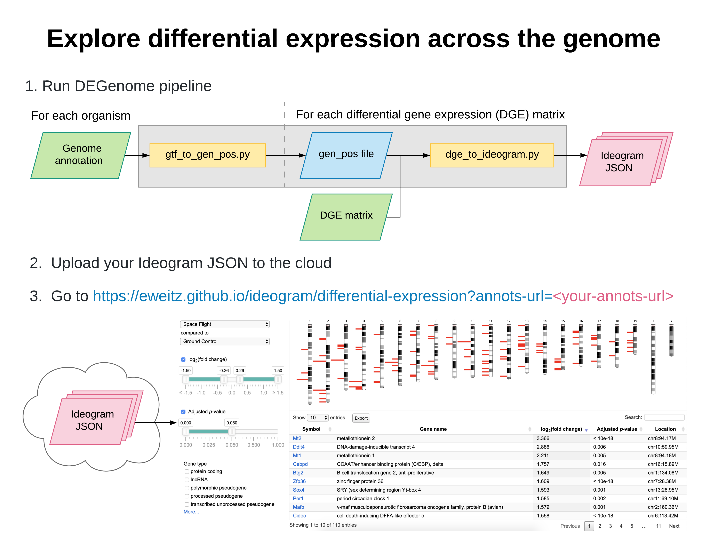

DEGenome – Differential expression across the genome
====================================================
|Build| |Coverage|

DEGenome transforms differential gene expression (DGE) data to Ideogram_ JSON.

Written in Python, the DEGenome pipeline takes in genome annotations and DGE
matrices, and outputs Ideogram.js JSON annotation files.

You can then upload Ideogram JSON to the cloud, and explore it in an
interactive genome visualization at
https://eweitz.github.io/ideogram/differential-expression.

.. _Ideogram: https://github.com/eweitz/ideogram

.. |Build| image:: https://img.shields.io/circleci/build/github/eweitz/degenome.svg
  :target: https://circleci.com/gh/eweitz/degenome

.. |Coverage| image:: https://codecov.io/gh/eweitz/degenome/branch/master/graph/badge.svg
  :target: https://codecov.io/gh/eweitz/degenome

.. toctree::
   :maxdepth: 2
   :hidden:

   installation
   reduce-gtf
   transform-dge-matrix